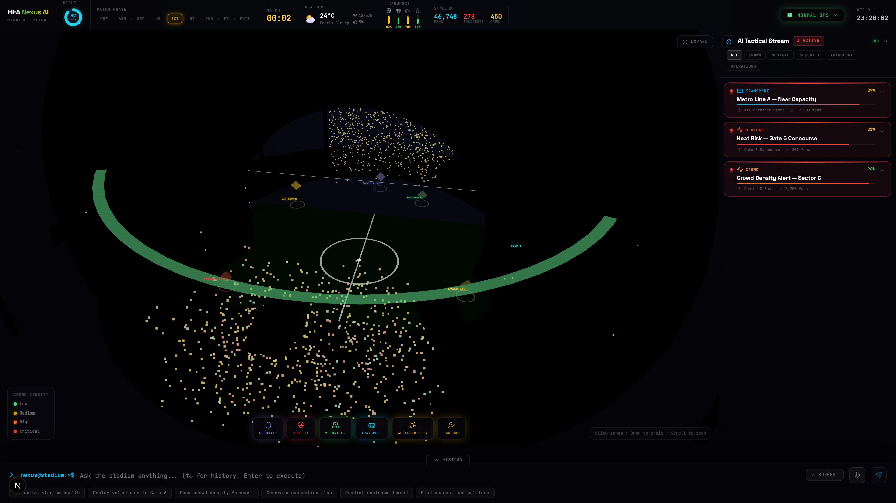
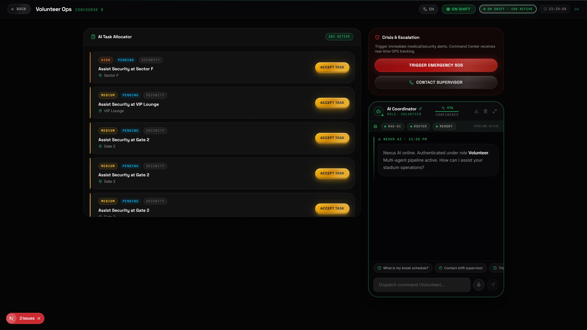

# ⚽ FIFA Nexus AI — Intelligent Stadium Operating System

<div align="center">


**An enterprise-grade AI Stadium Operating System for FIFA World Cup 2026**

[🚀 Quick Start](#-quick-start) • [🏗️ Architecture](#️-architecture) • [✨ Features](#-features) • [🤖 AI Copilot](#-ai-copilot) • [📖 API Docs](#-api-documentation)

</div>

## 📸 Screenshots

| Landing Page | Command Center (Organizer) |
|:---:|:---:|
|  |  |
| **Volunteer Dashboard** | |
|  | |

---

## 🌟 Problem Statement

Managing a FIFA World Cup stadium with 80,000+ fans in real time requires coordinating dozens of teams — security, medical, volunteers, transport, concessions, and emergency services — simultaneously. Today this is done with fragmented radio communications, spreadsheets, and manual handoffs.

**FIFA Nexus AI** solves this by providing a single AI-powered operating system that gives every stakeholder the right information at the right time, enabling them to take immediate action.

---

## 🏆 Challenge Vertical

**AI-Powered Stadium Operations** — Building an intelligent platform that uses Generative AI, real-time data, and a Digital Twin to transform how FIFA World Cup 2026 stadiums are managed.

---

## ✨ Features

### 🌙 Midnight Pitch Command Center (Organizer)
The flagship experience — a full-screen cinematic AI command center:
- **3D Digital Twin Stadium** — Interactive WebGL stadium with crowd density particles, clickable zones (concessions, medical, security, VIP, gates), and scenario-aware lighting
- **Stadium Pulse Header** — Match timeline (9 phases), animated health score gauge, live weather intelligence, real-time transport status bars
- **AI Tactical Stream** — Continuously streaming AI predictions with confidence scores, reasoning chains, evidence citations, and one-click playbook execution
- **Ask the Stadium Dock** — Persistent terminal-style AI command console with voice input, command history, auto-complete suggestions, and real-time token streaming
- **Scenario Engine** — 9 live scenarios (Lightning, Fire, Crowd Surge, VIP Breach, Evacuation, etc.) that transform the entire UI in real-time

### 🤖 AI Copilot (All Dashboards)
- **Google Gemini 1.5 Flash** integration with graceful fallback to intelligent simulation
- **RAG (Retrieval-Augmented Generation)** — ChromaDB vector store of stadium operations manuals
- **Multi-Agent Architecture** — 9 specialized agents (Navigation, Security, Medical, Volunteer, Transport, Accessibility, Sustainability, Communication, Ops Intelligence)
- **Real-Time Token Streaming** — Token-by-token rendering via WebSocket
- **Function Calling** — AI directly mutates live stadium state (dispatch volunteers, log incidents, place orders)
- **Explainable AI (XAI)** — Every response includes confidence score, evidence, expected impact, and alternatives
- **Voice Commands** — Web Speech API integration
- **Prompt Injection Protection** — Server-side detection of 8 injection patterns

### 🏟️ Role-Based Dashboards (7 Views)

| Dashboard | Role | Key Features |
|-----------|------|-------------|
| **Command Center** | Organizer | Midnight Pitch, 3D Digital Twin, AI Tactical Stream |
| **Fan Hub** | Fan | Food ordering, seat navigation, SOS emergency alert |
| **Security Ops** | Security Officer | Incident management, threat levels, officer dispatch |
| **Volunteer Hub** | Volunteer | Task management, shift tracking, SOS |
| **Medical Hub** | Medical Staff | Patient triage queue, ambulance dispatch, bed tracking |
| **Transport Hub** | Transport Manager | Parking control, shuttle dispatch, metro monitoring |
| **Accessibility Hub** | Accessibility Coordinator | Wheelchair escorts, audio guides, sensory room |

### 🔄 Cross-Dashboard Real-Time Coordination
- Fan orders food → Volunteer task auto-created
- SOS trigger → Incident logged in Security + Medical + Organizer simultaneously
- AI dispatches volunteer → State broadcast to all connected clients via WebSocket

---

## 🏗️ Architecture

```
┌────────────────────────────────────────────────────────────┐
│                   FIFA NEXUS AI                             │
│                                                            │
│  ┌─────────────────────────────────┐  ┌─────────────────┐  │
│  │       Next.js 16 Frontend        │  │  FastAPI Backend │  │
│  │                                 │  │                 │  │
│  │  /organizer — Midnight Pitch    │  │  REST API        │  │
│  │    ├── 3D Digital Twin (R3F)    │◄─►│  WebSocket /ws  │  │
│  │    ├── Stadium Pulse Header     │  │  Rate Limiting  │  │
│  │    ├── AI Tactical Stream       │  │  Input Sanitize │  │
│  │    └── Command Dock             │  │                 │  │
│  │                                 │  │  Gemini 1.5     │  │
│  │  /fan, /security, /medical,     │  │  Flash LLM      │  │
│  │  /volunteer, /transportation,   │  │                 │  │
│  │  /accessibility                 │  │  ChromaDB RAG   │  │
│  └─────────────────────────────────┘  └─────────────────┘  │
│                    │                         │              │
│            WebSocket                    Stadium State       │
│         (real-time sync)               (in-memory)         │
└────────────────────────────────────────────────────────────┘
```

### AI Agent Pipeline

```
User Query
    │
    ▼
[Prompt Injection Guard] → reject if unsafe
    │
    ▼
[Tool Execution] → detect_and_execute_tools()
    │             mutates stadium state directly
    ▼
[RAG Query] → ChromaDB vector store search
    │         returns relevant operations docs
    ▼
[LLM Generation] → Gemini 1.5 Flash streaming
    │              or intelligent fallback
    ▼
[Response Streaming] → WebSocket token-by-token
    │
    ▼
[State Broadcast] → all connected clients updated
```

---

## 🛠️ Technology Stack

| Layer | Technology |
|-------|-----------|
| Frontend Framework | Next.js 16 (App Router) |
| 3D Graphics | Three.js + React Three Fiber + Drei |
| Animations | Framer Motion |
| Styling | Tailwind CSS v4 + Custom CSS Design System |
| Backend API | FastAPI (Python 3.11) |
| AI / LLM | Google Gemini 1.5 Flash |
| Vector Store | ChromaDB |
| Real-Time | WebSocket (FastAPI native) |
| Rate Limiting | slowapi |
| Containerization | Docker + Docker Compose |
| Testing | pytest + FastAPI TestClient |
| Charts | Recharts |
| Maps | Leaflet.js + React Leaflet |

---

## 📁 Folder Structure

```
fifa-nexus-ai/
├── api/                          # FastAPI Backend
│   ├── main.py                   # API endpoints, WebSocket, rate limiting
│   ├── services/
│   │   ├── agents.py             # AI agent system + function calling
│   │   ├── rag.py                # ChromaDB RAG pipeline
│   │   └── state.py              # In-memory stadium state
│   ├── test_api.py               # pytest test suite (30 tests)
│   ├── requirements.txt
│   └── Dockerfile
│
├── web/                          # Next.js Frontend
│   ├── src/
│   │   ├── app/
│   │   │   ├── organizer/        # Midnight Pitch Command Center
│   │   │   ├── fan/              # Fan Hub
│   │   │   ├── security/         # Security Ops
│   │   │   ├── medical/          # Medical Hub
│   │   │   ├── volunteer/        # Volunteer Hub
│   │   │   ├── transportation/   # Transport Hub
│   │   │   ├── accessibility/    # Accessibility Hub
│   │   │   └── globals.css       # Design system
│   │   └── components/
│   │       ├── midnight/         # Command Center components
│   │       │   ├── ScenarioEngine.tsx
│   │       │   ├── StadiumPulseHeader.tsx
│   │       │   ├── DigitalTwinScene.tsx
│   │       │   ├── TacticalStream.tsx
│   │       │   ├── CommandDock.tsx
│   │       │   └── HealthScore.tsx
│   │       ├── AIChat.tsx        # AI Copilot component
│   │       ├── FootballScene.tsx # Landing page 3D scene
│   │       ├── NavHeader.tsx     # Page header
│   │       ├── Modal.tsx
│   │       ├── Toast.tsx
│   │       └── StadiumMap.tsx    # Leaflet map
│   └── Dockerfile
│
├── docker-compose.yml
├── .env.example
├── .gitignore
└── README.md
```

---

## 🚀 Quick Start

### Prerequisites
- Docker Desktop installed and running
- Git

### One-Command Launch

```bash
git clone https://github.com/your-org/fifa-nexus-ai.git
cd fifa-nexus-ai
cp .env.example .env          # Add your GEMINI_API_KEY
docker compose up --build
```

Then open **http://localhost:3000** in your browser.

> **No API key?** The application runs fully in simulation mode with intelligent fallback responses. Every feature works without any external service.

---

## ⚙️ Environment Variables

Copy `.env.example` to `.env`:

```bash
cp .env.example .env
```

| Variable | Required | Description |
|----------|----------|-------------|
| `GEMINI_API_KEY` | Optional | Google Gemini API key for real AI responses. Get one free at [aistudio.google.com](https://aistudio.google.com) |

### Getting a Free Gemini API Key

1. Visit [aistudio.google.com](https://aistudio.google.com)
2. Sign in with a Google account
3. Click **"Get API Key"**
4. Copy the key to your `.env` file

---

## 🤖 AI Model Integration

The AI Copilot uses **Google Gemini 1.5 Flash** via the official `google-generativeai` Python SDK.

**Auto-detection logic:**
```python
if GEMINI_API_KEY:
    → Use Gemini 1.5 Flash with real-time streaming
else:
    → Intelligent simulation with contextual responses
```

**Supported query types:**
- Stadium operations ("Show crowd density", "Predict bottleneck")
- Dispatch commands ("Deploy 5 volunteers to Gate 6")
- Emergency responses ("Generate evacuation plan")
- Translations ("Translate PA to Spanish")
- Analytics ("Summarize stadium health")

---

## 🔒 Security

- **Input Validation** — All API endpoints validated with Pydantic v2 with strict field constraints
- **Length Limits** — Messages capped at 1,000 characters, locations at 100 chars, etc.
- **Prompt Injection Detection** — 8 regex patterns block adversarial prompts server-side
- **HTML Sanitization** — All user inputs stripped of HTML tags before processing
- **Rate Limiting** — slowapi rate limiter on AI endpoints
- **CORS** — Restricted to `localhost:3000` (not `*`)
- **No Secrets Committed** — All keys via environment variables only
- **Input Allowlisting** — Severity, priority, status fields use regex pattern validation

---

## 🧪 Testing

```bash
cd api
pip install -r requirements.txt
pytest test_api.py -v
```

**30 tests covering:**
- All REST endpoints (incidents, tasks, orders, medical, security, accessibility)
- State mutation unit tests
- Input validation (invalid severity, negative prices, oversized payloads)
- XSS sanitization verification
- Boundary conditions (non-existent IDs, invalid status values)

---

## ♿ Accessibility

- Semantic HTML5 throughout
- ARIA labels on all interactive elements
- `aria-pressed` for toggle buttons
- `aria-expanded` for accordion/dropdown elements
- `aria-label` on all icon-only buttons
- Keyboard navigable (Tab, Enter, Space, Arrow keys in Command Dock)
- Focus states on all interactive elements
- Color contrast meets WCAG AA standards
- Responsive layout (mobile, tablet, desktop)

---

## 🎬 Demo Flow

1. Open **http://localhost:3000** — cinematic landing with 3D rotating football
2. Click **"Enter Command Center"** → Midnight Pitch opens
3. **Change Scenario** → top-right dropdown → try "Lightning" or "Crowd Surge"
4. **Click any zone** in the 3D stadium → info panel opens
5. **Click Health Score** → AI explanation modal
6. **Tactical Stream** → click a prediction → expand → Execute a play
7. **Command Dock** → type "Deploy 5 volunteers to Gate 6" → Enter
8. **Hub Navigation** → bottom overlay buttons → explore sub-dashboards
9. **AI Copilot** → on any sub-dashboard, use the chat to send commands

---

## 📐 Architecture Diagram

```
Browser
  │
  ├── /               → Landing page (3D ball, scroll experience)
  ├── /organizer      → Midnight Pitch Command Center
  │     ├── 3D Digital Twin (WebGL, Three.js)
  │     ├── Stadium Pulse Header (Health, Weather, Transport)
  │     ├── AI Tactical Stream (Predictions, Playbooks)
  │     └── Command Dock (AI terminal, WebSocket)
  ├── /fan            → Fan dashboard (food, navigation, SOS)
  ├── /security       → Security ops (incidents, threat levels)
  ├── /medical        → Medical hub (triage, ambulances)
  ├── /volunteer      → Volunteer tasks (assignment, shift)
  ├── /transportation → Transport (parking, shuttles, metro)
  └── /accessibility  → Accessibility (escorts, guides, sensory)
         │
         │ WebSocket (ws://localhost:8000/ws)
         │ REST API (http://localhost:8000/api/*)
         ▼
     FastAPI Backend
         │
         ├── Prompt Injection Guard
         ├── Input Validation (Pydantic v2)
         ├── Rate Limiting (slowapi)
         ├── Tool Execution (mutates stadium state)
         ├── RAG Query (ChromaDB)
         └── Gemini 1.5 Flash (streaming)
```

---

## 🔮 Future Scope

- **Real CCTV Integration** — Live camera feeds with AI object detection
- **Digital Twin Physics** — Real-time crowd simulation with agent-based modeling
- **Predictive ML Models** — Trained on historical FIFA World Cup crowd data
- **Multi-Language PA** — Real-time crowd announcements in 30+ languages
- **Mobile PWA** — Native-feeling mobile app for volunteers and fans
- **Real-Time IoT** — Sensor integration for temperature, CO2, noise levels
- **Biometric Integration** — VIP access control with facial recognition
- **Sustainability Dashboard** — Real-time energy, water, and carbon tracking

---

## 📋 Assumptions

1. The stadium state is in-memory for this MVP (no persistence across restarts)
2. CCTV feeds are simulated (bounding boxes drawn via WebGL, not real streams)
3. Weather data is simulated (production would use a real weather API)
4. Transport data is simulated (production would use city transit APIs)
5. The application targets modern browsers (Chrome, Firefox, Edge) with WebGL support

---

## 📄 License

MIT License — see [LICENSE](LICENSE) for details.

---

<div align="center">

**Built for the FIFA World Cup 2026 AI Hackathon**

⚽ *The future of stadium operations is here.*

</div>
